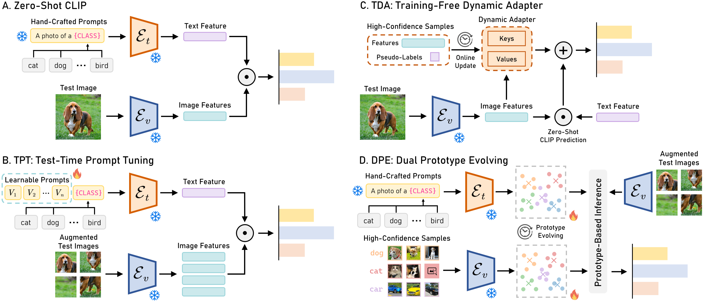

# [NeurIPS 2024] DPE-CLIP
[](https://zhangce01.github.io/DPE-CLIP/)
[](http://arxiv.org/abs/2410.12790)
[](https://neurips.cc/)
[](https://opensource.org/licenses/MIT)

## 👀Introduction
This repository contains the code for our NeurIPS 2024 paper `Dual Prototype Evolving for Test-Time Generalization of Vision-Language Models`. [[Paper](https://arxiv.org/abs/2410.12790)]



## ⏳Setup

#### 1. Environment
We test our codebase with PyTorch 2.1.1 with CUDA 12.1. Please install corresponding PyTorch and CUDA versions according to your computational resources. Then install the rest of required packages by running `pip install -r requirements.txt`. Please install the info-nce-pytorch package following https://github.com/RElbers/info-nce-pytorch.

#### 2. Dataset
To set up all required datasets, kindly refer to the guidance in [DATASETS.md](docs/DATASETS.md), which incorporates steps for installing two benchmarks.

## 📦Usage
To run the code, you can execute the following 4 bash scripts:

#### Robustness to Natural Distribution Shifts
* **ResNet50**: Run DPE on the OOD Benchmark using the ResNet-50 model:
```
bash ./scripts/run_ood_benchmark_rn50.sh 
```
* **ViT/B-16**: Run DPE on the OOD Benchmark using the ViT/B-16 model.
```
bash ./scripts/run_ood_benchmark_vit.sh 
```

#### Cross-Datasets Generalization
* **ResNet50**: Run DPE on the Cross-Domain Benchmark using the ResNet-50 model:
```
bash ./scripts/run_cd_benchmark_rn50.sh 
```
* **ViT/B-16**: Run DPE on the Cross-Domain Benchmark using the ViT/B-16 model.
```
bash ./scripts/run_cd_benchmark_vit.sh 
```

#### Arguments
In each bash script, you can modify the following arguments: (1) `--datasets` to specify the datasets, (2) `--backbone` to specify the backbone model (RN50 and ViT-B/16), and (3) `--coop` to enable the learned prompts by CoOp. We use `wandb` to track the results. If you wish to deactivate this feature, simply omit the `--wandb-log` argument.


## 🙏Acknowledgements

Our codebase is adapted from [Tip-Adapter](https://github.com/gaopengcuhk/Tip-Adapter/), [CLIP](https://github.com/openai/CLIP/tree/main/clip), [TDA](https://github.com/kdiAAA/TDA), [TPT](https://github.com/azshue/TPT), and [CuPL](https://github.com/sarahpratt/CuPL). We thank the authors for releasing their code!

## 📧Contact

If you have any questions, please  contact at [cezhang@cs.cmu.edu](mailto:cezhang@cs.cmu.edu).

## 📌 BibTeX & Citation

If you find this code useful, please consider citing our work:

```bibtex
@article{zhang2024dual,
  title={Dual prototype evolving for test-time generalization of vision-language models},
  author={Zhang, Ce and Stepputtis, Simon and Sycara, Katia and Xie, Yaqi},
  journal={Advances in Neural Information Processing Systems},
  volume={37},
  pages={32111--32136},
  year={2024}
}
```
